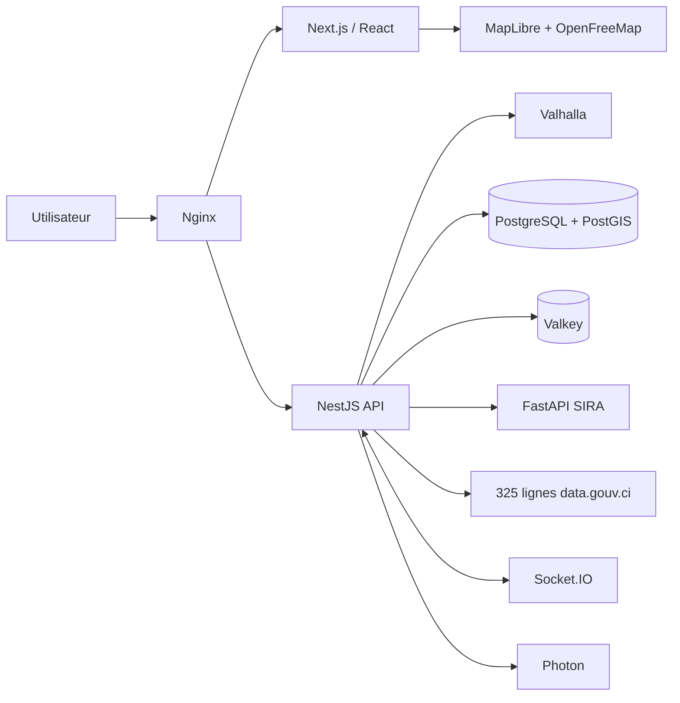

# SIRA — MVP Smart Mobility Abidjan

SIRA est un MVP de mobilité multimodale pour Abidjan. Il compare plusieurs manières d’effectuer un trajet en combinant marche, SOTRA, gbaka et taxi selon le temps, le coût, le confort et la fiabilité.

## Ce qui fonctionne déjà

- carte interactive MapLibre GL JS avec tuiles OpenFreeMap / OpenStreetMap ;
- recherche de lieux via Photon, avec données locales de secours ;
- géolocalisation via la Geolocation API du navigateur ;
- recommandations Grand Abidjan calculées sur le réseau, sans zone prédéfinie ;
- réglage du budget et de la préférence utilisateur ;
- détail étape par étape des modes et correspondances ;
- signalements communautaires de démonstration ;
- assistant mobilité texte avec réponses liées au trajet ;
- interface responsive desktop/mobile ;
- API NestJS, passerelle Socket.IO et moteur SIRA-MORE FastAPI ;
- graphe transport Grand Abidjan construit sur 325 lignes historiques ;
- schéma PostgreSQL/PostGIS et jeu GTFS pilote ;
- orchestration Podman Compose, cache Valkey et proxy Nginx ;
- Valhalla obligatoire pour afficher les accès et correspondances piétonnes comme chemins praticables ;
- attentes calculées à partir des fréquences/tranches horaires historiques lorsqu’elles existent, avec P50, P90 et confiance ;
- tarifs et temps en véhicule présentés comme estimations, jamais comme données temps réel.

> Les géométries de transport proviennent du jeu ouvert data.gouv.ci / DigitalTransport4Africa, mis à jour en octobre 2021. Les durées, attentes, arrêts d’accès et tarifs restent des estimations MVP à valider avec les opérateurs.

## Architecture



## Démarrage rapide de la stack fonctionnelle

Prérequis : Node.js 22 ou version supérieure.

```bash
npm install
npm run dev:stack
```

Cette commande démarre l’interface, l’API NestJS et le moteur SIRA-MORE FastAPI. L’application est ensuite disponible sur `http://localhost:3000`. `npm run dev` ne lance que l’interface et ne permet pas de calculer un trajet.

SIRA-MORE est obligatoire par défaut : si FastAPI est arrêté, NestJS renvoie une erreur explicite au lieu d’afficher un classement de secours sous le nom SIRA-MORE. Le secours déterministe ne peut être activé volontairement qu’avec `SIRA_ALLOW_RANKING_FALLBACK=true`.

### Sur Windows

1. Installer **Node.js 22 LTS** depuis `https://nodejs.org/`.
2. Décompresser le projet dans un dossier simple, par exemple `C:\Projets\sira-mobility-mvp`.
3. Installer également **Python 3**, nécessaire au moteur SIRA-MORE.
4. Double-cliquer sur `LANCER_SIRA_WINDOWS.bat`.
5. Attendre le message `Moteur prêt`, puis aller sur `http://localhost:3000`.

La première exécution installe automatiquement les dépendances. Pour arrêter le serveur, revenir dans la fenêtre noire et appuyer sur `Ctrl + C`.

Si le fichier `.bat` ne démarre pas, ouvrir PowerShell dans le dossier du projet et exécuter :

```powershell
npm install
npm run dev:stack
```

Le frontend n’utilise plus de trajets codés en dur. Le lanceur complet démarre donc obligatoirement l’API NestJS et le moteur FastAPI. En développement sans `VALHALLA_URL`, il utilise le serveur public Valhalla uniquement pour les essais ; la production doit héberger sa propre instance.

Pour vérifier automatiquement que NestJS appelle réellement SIRA-MORE :

```bash
npm run test:runtime
```

## Démarrage de toute la stack avec Podman

Prérequis : Podman et `podman compose`.

```bash
podman compose up --build
```

Cette commande lance l’interface, NestJS, FastAPI, PostgreSQL/PostGIS, Valkey et Nginx. Accès principal : `http://localhost:8080`. Elle ne lance pas Valhalla, placé dans le profil `routing`.

Pour ajouter Valhalla et construire les tuiles routables de Côte d’Ivoire :

```bash
podman compose --profile routing up --build
```

Le premier lancement de Valhalla télécharge le fichier OSM de Côte d’Ivoire et peut être long. Sans Valhalla, SIRA peut analyser le graphe des 325 lignes, mais rejette les propositions dont l’accès, la sortie ou la correspondance piétonne ne peut pas être confirmée. Il ne dessine donc plus de ligne droite trompeuse. Pour des essais techniques seulement, `SIRA_ALLOW_ESTIMATED_WALK_CONNECTORS=true` autorise une liaison de 150 m maximum, sans géométrie et explicitement marquée « sans guidage ».

Après le démarrage de Valhalla, lancer le contrôle réel des accès piétons :

```bash
npm run test:routing:live
```

Pour un contrôle ponctuel avec le serveur public FOSSGIS — jamais comme dépendance de production — utiliser `VALHALLA_URL=https://valhalla1.openstreetmap.de npm run test:routing:live`. Le script respecte la cadence publique et vérifie notamment qu’un point proche à vol d’oiseau peut être rejeté lorsque le chemin praticable dépasse la limite SIRA.

## Couverture et provenance des données

- Source : `https://data.gouv.ci/datasets/abidjantransport-lignes` (licence ouverte).
- Contenu : 325 lignes SOTRA, gbaka, wôrô-wôrô et bateaux-bus.
- Graphe généré : environ 18 900 nœuds ; 96,9 % des nœuds appartiennent à la composante principale.
- Couverture : réseau de transport du Grand Abidjan, et non toutes les rues piétonnes.
- Complément routier : OpenStreetMap via Valhalla pour la marche, la route et les accès aux lignes.
- Statut : géométries historiques ; horaires, attentes, durées et tarifs estimés en attendant les flux opérateurs.

### Logique de raccordement et d’estimation

1. Le moteur utilise la distance géodésique uniquement pour repérer les nœuds de transport proches.
2. Une correspondance entre deux lignes distinctes est admise dans le graphe jusqu’à 350 m, puis doit être confirmée sur le réseau piéton OpenStreetMap par Valhalla.
3. La marche d’accès, la marche de sortie et les correspondances sont additionnées et comparées à la contrainte utilisateur.
4. Une ligne dont les horaires historiques indiquent qu’elle est fermée est exclue du calcul.
5. L’attente médiane vaut la moitié de l’intervalle déclaré ; le P90 vaut 90 % de cet intervalle. Si la fréquence manque, un a priori par mode est utilisé avec une confiance plus faible.
6. Les durées en véhicule utilisent une vitesse moyenne par mode et les tarifs utilisent des règles MVP. Chaque valeur conserve sa méthode, son P90 et son niveau de confiance afin d’être remplacée plus tard par GTFS, GPS opérateur ou observations terrain.

La sélection d’itinéraire suit le pipeline SIRA-MORE Phase 1 : contraintes strictes (budget, marche, correspondances et modes), frontière de Pareto, contrôle de diversité, score selon la préférence, puis explications. Les anciens axes de démonstration restent uniquement des fixtures internes de non-régression et ne sont ni affichés ni utilisés comme limite géographique.

## Services et ports

| Service | Port local | Rôle |
| --- | ---: | --- |
| Nginx | 8080 | point d’entrée de la stack |
| Frontend | 3000 | interface Next.js / React |
| NestJS | 4000 | orchestration mobilité et signalements |
| FastAPI | 8000 | classement explicable des trajets |
| Valhalla | 8002 | routage OSM, profil optionnel |
| PostgreSQL/PostGIS | 5432 interne | données géospatiales |
| Valkey | 6379 interne | cache et état temps réel |

## Endpoints principaux

- `GET /api/v1/health`
- `GET /api/v1/mobility/search?q=plateau`
- `POST /api/v1/mobility/journeys`
- `GET /api/v1/reports`
- `POST /api/v1/reports`
- Socket.IO : namespace `/traffic`, événement `traffic.report.created`
- FastAPI : `POST /v1/recommendations/rank`
- documentation FastAPI locale : `http://localhost:8000/docs`

Exemple de calcul :

```json
{
  "origin": { "lat": 5.3467, "lon": -3.9951, "name": "Cocody Danga" },
  "destination": { "lat": 5.3196, "lon": -4.0201, "name": "Plateau Gare Sud" },
  "budget": 1500,
  "preference": "balanced",
  "constraints": {
    "maxWalkingDistanceM": 1500,
    "maxTransfers": 3,
    "excludedModes": []
  }
}
```

## Scénario de démonstration

1. Ouvrir SIRA avec la stack active.
2. Saisir librement deux lieux du Grand Abidjan.
3. Cliquer sur « Rechercher un trajet ».
4. Comparer les alternatives conformes et non dominées proposées par SIRA-MORE.
5. Sélectionner une option pour afficher son tracé et ses étapes.
6. Ouvrir « Assistant SIRA » et demander : « Quel est le trajet le moins cher ? ».
7. Consulter le trafic en direct et les signalements communautaires.
8. Cliquer sur « Démarrer ce trajet » pour terminer le parcours de démonstration.

## Structure du dépôt

```text
app/                    interface Next.js
components/             composants fonctionnels SIRA
lib/                    modèles d’interface
services/api/           backend NestJS + Socket.IO
services/ai/            moteur de recommandation FastAPI
infra/database/init/    schéma et données PostGIS
infra/nginx/            reverse proxy
data/raw/               source ouverte des 325 lignes
data/pilot/             fixtures internes de non-régression
data/gtfs-demo/         feed GTFS pilote Abidjan
compose.yaml             orchestration Podman
```

## Limites connues du MVP

- le calcul d’itinéraire exige les services API et IA ; aucun trajet statique n’est présenté en secours ;
- la couverture correspond aux 325 lignes historiques disponibles et à leurs raccordements ; elle n’implique pas encore une couverture exhaustive de chaque rue piétonne ;
- les signalements sont en mémoire dans NestJS : l’écriture PostGIS sera reliée dans l’itération suivante ;
- l’authentification, la modération avancée et la navigation GPS virage par virage ne sont pas encore destinées à la production ;
- les données ouvertes datent de 2021 : le transport informel nécessite une collecte terrain et une validation communautaire avant diffusion réelle ;
- le service public OpenFreeMap ne fournit pas de SLA : prévoir un hébergement de tuiles pour la production.

## Attributions techniques

La carte utilise MapLibre GL JS et OpenFreeMap. Les données cartographiques proviennent d’OpenStreetMap. Le routage est conçu pour Valhalla et les transports sont modélisés selon GTFS Schedule.
