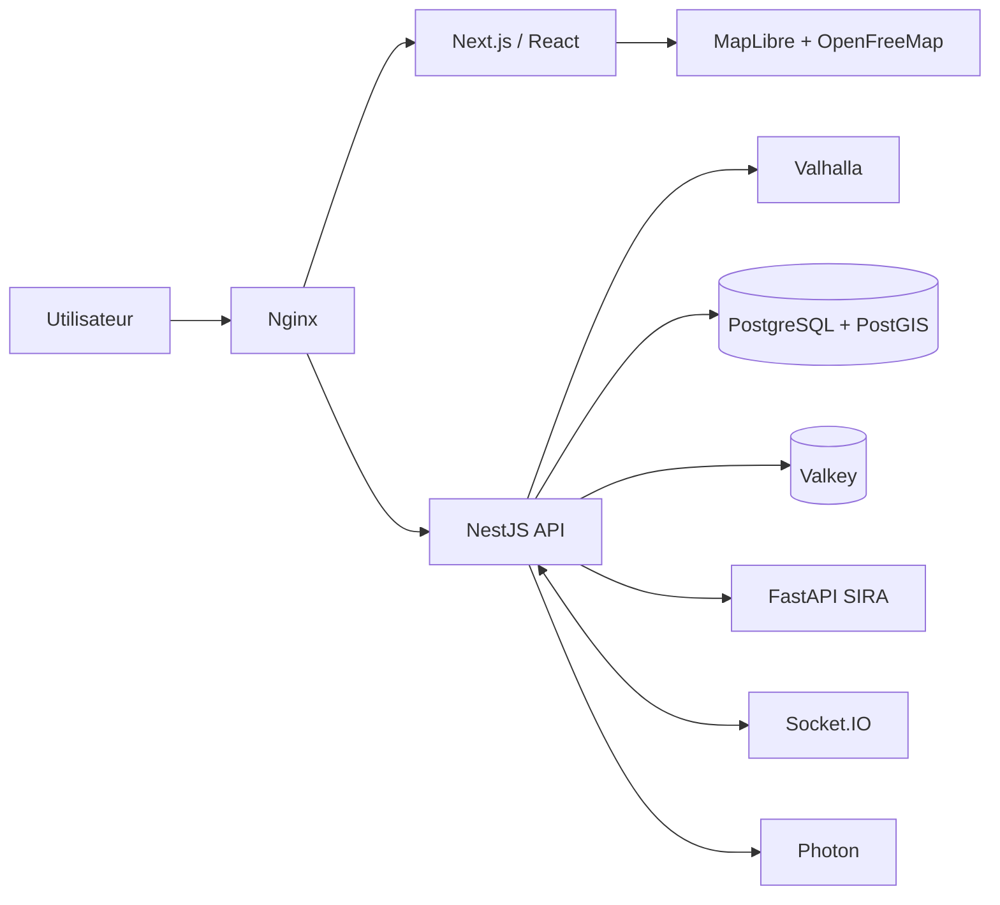

# SIRA — MVP Smart Mobility Abidjan

SIRA est un MVP de mobilité multimodale pour Abidjan. Il compare plusieurs manières d’effectuer un trajet en combinant marche, SOTRA, gbaka et taxi selon le temps, le coût, le confort et la fiabilité.

## Ce qui fonctionne déjà

- carte interactive MapLibre GL JS avec tuiles OpenFreeMap / OpenStreetMap ;
- recherche de lieux via Photon, avec données locales de secours ;
- géolocalisation via la Geolocation API du navigateur ;
- comparaison de trois trajets : recommandé, rapide et économique ;
- réglage du budget et de la préférence utilisateur ;
- détail étape par étape des modes et correspondances ;
- signalements communautaires de démonstration ;
- assistant mobilité texte avec réponses liées au trajet ;
- interface responsive desktop/mobile ;
- API NestJS, passerelle Socket.IO et moteur de ranking FastAPI ;
- schéma PostgreSQL/PostGIS et jeu GTFS pilote ;
- orchestration Podman Compose, cache Valkey et proxy Nginx ;
- Valhalla optionnel, avec calcul de secours lorsque le service n’est pas lancé.

> Les lignes, horaires et tarifs du dossier `data/gtfs-demo` constituent un jeu pilote synthétique pour la démonstration. Ils ne doivent pas être présentés comme des données officielles SOTRA.

## Architecture



## Démarrage rapide de l’interface

Prérequis : Node.js 22 ou version supérieure.

```bash
npm install
npm run dev
```

L’application est ensuite disponible sur `http://localhost:3000`.

### Sur Windows

1. Installer **Node.js 22 LTS** depuis `https://nodejs.org/`.
2. Décompresser le projet dans un dossier simple, par exemple `C:\Projets\sira-mobility-mvp`.
3. Double-cliquer sur `LANCER_SIRA_WINDOWS.bat`.
4. Attendre l’ouverture du serveur, puis aller sur `http://localhost:3000`.

La première exécution installe automatiquement les dépendances. Pour arrêter le serveur, revenir dans la fenêtre noire et appuyer sur `Ctrl + C`.

Si le fichier `.bat` ne démarre pas, ouvrir PowerShell dans le dossier du projet et exécuter :

```powershell
npm install
npm run dev
```

Pour cette visualisation rapide, Podman, PostgreSQL, FastAPI et NestJS ne sont pas obligatoires : le frontend utilise les données de démonstration intégrées.

## Démarrage de toute la stack avec Podman

Prérequis : Podman et `podman compose`.

```bash
podman compose up --build
```

Cette commande lance l’interface, NestJS, FastAPI, PostgreSQL/PostGIS, Valkey et Nginx. Accès principal : `http://localhost:8080`.

Pour ajouter Valhalla et construire les tuiles routables de Côte d’Ivoire :

```bash
podman compose --profile routing up --build
```

Le premier lancement de Valhalla télécharge le fichier OSM de Côte d’Ivoire et peut être long. Sans Valhalla, l’API reste utilisable grâce au calcul géodésique de secours ; la carte et le moteur SIRA continuent donc de fonctionner pour la démonstration.

## Services et ports

| Service | Port local | Rôle |
| --- | ---: | --- |
| Nginx | 8080 | point d’entrée de la stack |
| Frontend | 3000 | interface Next.js / React |
| NestJS | 4000 | orchestration mobilité et signalements |
| FastAPI | 8000 | classement explicable des trajets |
| Valhalla | 8002 | routage OSM, profil optionnel |
| PostgreSQL/PostGIS | 5432 interne | données géospatiales |
| Valkey | 6379 interne | cache et état temps réel |

## Endpoints principaux

- `GET /api/v1/health`
- `GET /api/v1/mobility/search?q=plateau`
- `POST /api/v1/mobility/journeys`
- `GET /api/v1/reports`
- `POST /api/v1/reports`
- Socket.IO : namespace `/traffic`, événement `traffic.report.created`
- FastAPI : `POST /v1/recommendations/rank`
- documentation FastAPI locale : `http://localhost:8000/docs`

Exemple de calcul :

```json
{
  "origin": { "lat": 5.3467, "lon": -3.9951, "name": "Cocody Danga" },
  "destination": { "lat": 5.3196, "lon": -4.0201, "name": "Plateau Gare Sud" },
  "budget": 1500,
  "preference": "balanced"
}
```

## Scénario de démonstration

1. Ouvrir SIRA : le trajet Cocody Danga → Plateau Gare Sud est préchargé.
2. Choisir un budget maximal de 1 500 FCFA et la préférence « Équilibré ».
3. Cliquer sur « Trouver les meilleurs trajets ».
4. Comparer l’option recommandée, l’option rapide et l’option économique.
5. Sélectionner une option pour afficher son tracé et ses étapes.
6. Ouvrir « Assistant SIRA » et demander : « Quel est le trajet le moins cher ? ».
7. Consulter le trafic en direct et les signalements communautaires.
8. Cliquer sur « Démarrer ce trajet » pour terminer le parcours de démonstration.

## Structure du dépôt

```text
app/                    interface Next.js
components/             composants fonctionnels SIRA
lib/                    modèles et moteur de démonstration
services/api/           backend NestJS + Socket.IO
services/ai/            moteur de recommandation FastAPI
infra/database/init/    schéma et données PostGIS
infra/nginx/            reverse proxy
data/gtfs-demo/         feed GTFS pilote Abidjan
compose.yaml             orchestration Podman
```

## Limites connues du MVP

- le frontend public emploie un moteur déterministe de secours pour rester démontrable sans infrastructure privée ;
- les signalements sont en mémoire dans NestJS : l’écriture PostGIS sera reliée dans l’itération suivante ;
- l’authentification, la modération avancée et la navigation GPS virage par virage ne sont pas encore destinées à la production ;
- le transport informel nécessite une collecte terrain et une validation communautaire avant diffusion réelle ;
- le service public OpenFreeMap ne fournit pas de SLA : prévoir un hébergement de tuiles pour la production.

## Attributions techniques

La carte utilise MapLibre GL JS et OpenFreeMap. Les données cartographiques proviennent d’OpenStreetMap. Le routage est conçu pour Valhalla et les transports sont modélisés selon GTFS Schedule.
