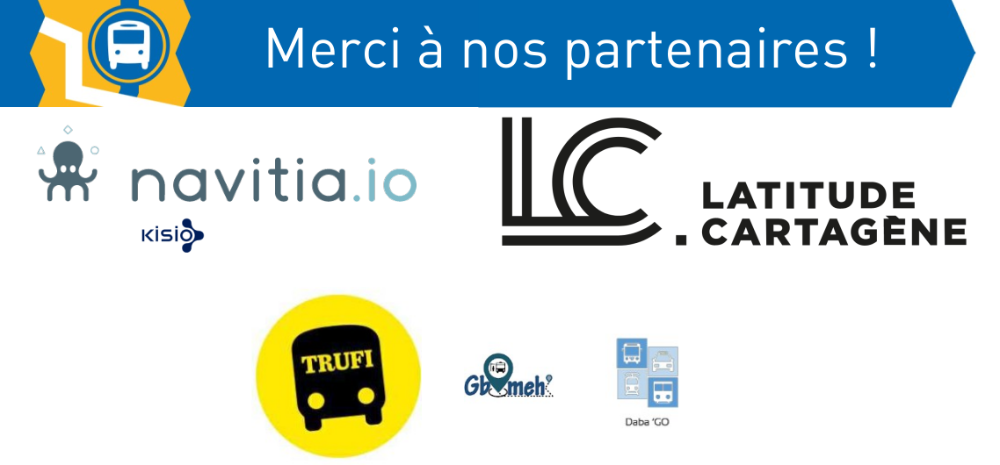
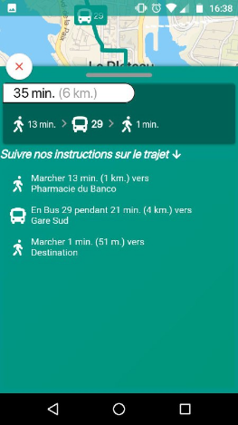
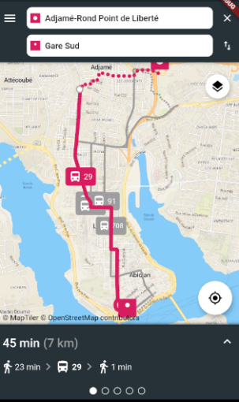
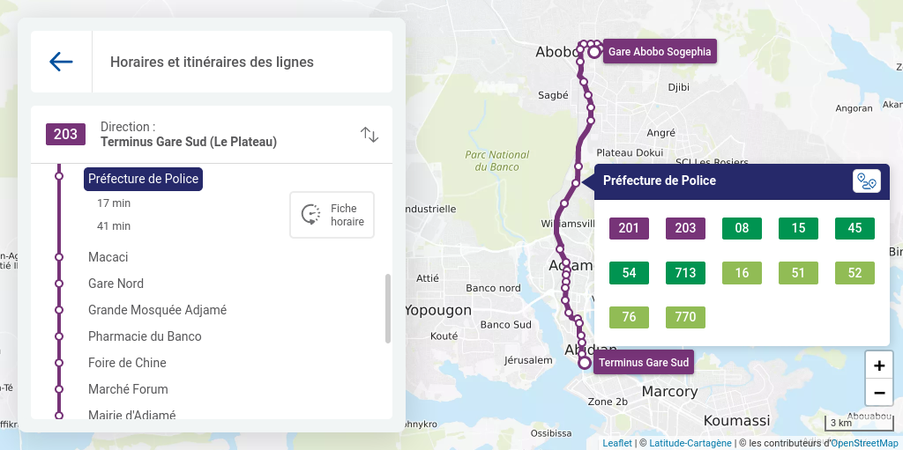
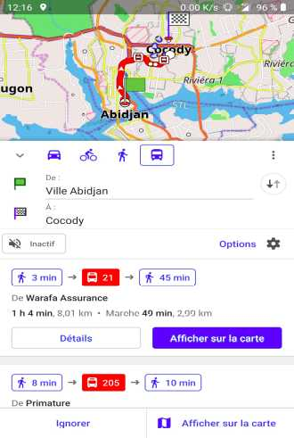
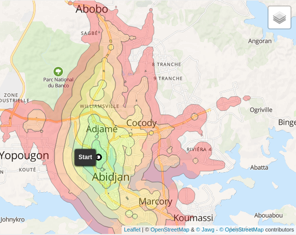

# Formation AbidjanTransport - démo et liens

Cette page liste quelques ressources qui ont été réalisées à partir des données du projet et qui ont pu être montrées sous forme de démo lors de la session de formation de décembre 2020.

## Plan schématique

[Télécharger](https://git.digitaltransport4africa.org/data/africa/abidjan/-/raw/master/Plan/plan_schematique.pdf?inline=false)

Merci à notre partenaire [Latitude Cartagène](https://latitude-cartagene.com/) !

## Application mobile Gbameh

* [Vidéo de présentation](demo_gbameh.webm)
* 

Merci à notre partenaire Gbameh !

## Application mobile Trufi pour Abidjan et ChatBot Telegram

* [Télécharger](trufi_abidjan.apk)
* [Vidéo de démonstration](demo_abidjan_trufi.mkv)
* [Vidéo de démonstration](demo_trufiTelegramBot.mp4)

Merci à notre partenaire [Trufi](https://www.trufi-association.org/)

## Carte interactive et calcul d'itinéraire
https://abidjan.preprod.latitude-cartagene.com

Merci à notre partenaire [Latitude Cartagène](https://latitude-cartagene.com/)

## Application mobile OSMAnd

* 
* [Vidéo de démonstration](demo_osmand_carto_interactive.webm)
* [Vidéo de démonstration](demo_osmand_iti.webm)

En savoir plus sur [OSMAnd](http://osmand.net/)

## Système d'Information Voyageurs navitia

Merci à notre partenaire [Kisio Digital](https://www.navitia.io/)
