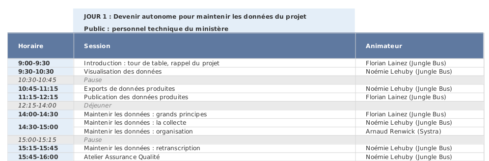
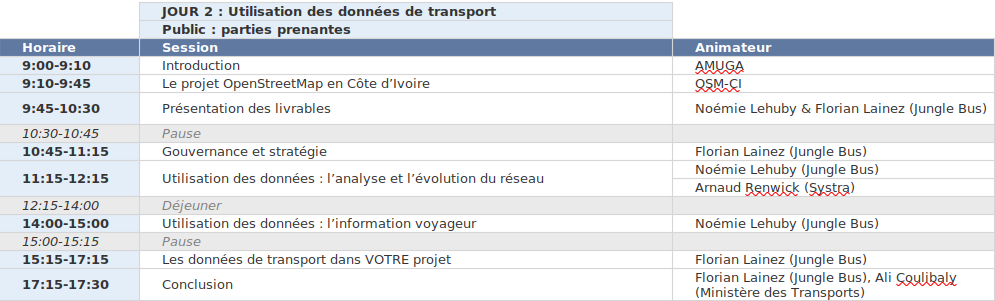

# Formations réalisées dans le cadre du projet

## Octobre 2019

Une [formation](2019-10-10_AbidjanTransport_formation_collecteurs_terrain.pdf) aux collecteurs terrain a été réalisée par Systra et Jungle Bus.

Un atelier interactif sur la cartographie des données de transport dans OpenStreetMap a été réalisée par Jungle Bus, à partir des éléments de la page de [wiki](https://wiki.openstreetmap.org/wiki/FR:WikiProject_C%C3%B4te_d'Ivoire/Transport_Abidjan).

## Novembre 2019

Une après-midi de formation a été réalisée pour les communes d'Abidjan et les transporteurs intéressés :
* [présentation du projet](2019-11-27_Formation_introduction_rappel_sur_le_projet.pdf), par Jungle Bus
* [présentation générale d'OpenStreetMap](2019-11-27_Formation_presentation_OSM.pdf), par OSM CI
* [formation et atelier interactif "créer une carte numérique interactive avec OpenStreetMap"](2019-11-27_Formation_umap_overpass.pdf), par Jungle Bus

## Décembre 2020

Les 10 et 11 décembre, une formation a été réalisée dans les locaux de l'AMUGA, par Jungle Bus, Systra et OSM CI

En complément des supports de formation rassemblés ici, plusieurs [vidéos de démonstration](2020-12-11_démo/readme.md) sont également consultables
